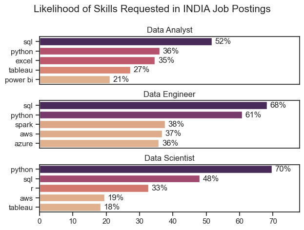
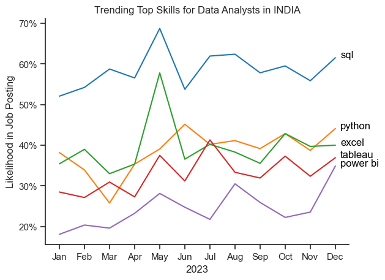
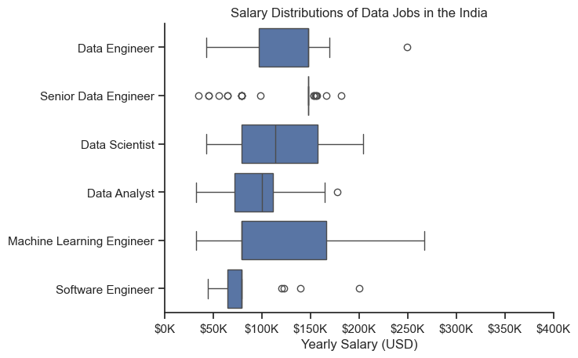
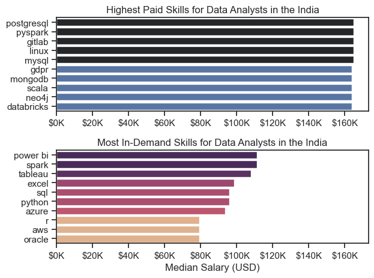
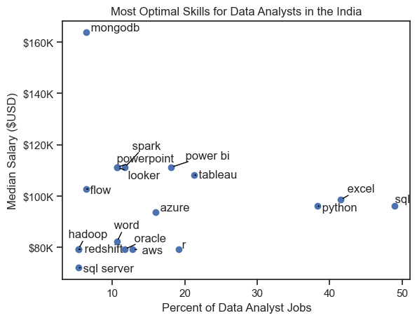
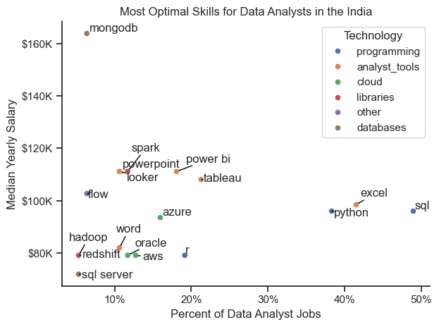

# Overview

Welcome to my analysis of the data job market, focusing on data analyst roles. This project was created out of a desire to navigate and understand the job market more effectively. It delves into the top-paying and in-demand skills to help find optimal job opportunities for data analysts.

# The Questions

Below are the questions I want to answer in my project:

1. What are the skills most in demand for the top 3 most popular data roles?
2. How are in-demand skills trending for Data Analysts?
3. How well do jobs and skills pay for Data Analysts?
4. What are the optimal skills for data analysts to learn? (High Demand AND High Paying) 

# Tools I Used

For my deep dive into the data analyst job market, I harnessed the power of several key tools:

- **Python:** The backbone of my analysis, allowing me to analyze the data and find critical insights.I also used the following Python libraries:
    - **Pandas Library:** This was used to analyze the data. 
    - **Matplotlib Library:** I visualized the data.
    - **Seaborn Library:** Helped me create more advanced visuals. 
- **Jupyter Notebooks:** The tool I used to run my Python scripts which let me easily include my notes and analysis.
- **Visual Studio Code:** My go-to for executing my Python scripts.
- **Git & GitHub:** Essential for version control and sharing my Python code and analysis, ensuring collaboration and project tracking.

# Data Preparation and Cleanup

This section outlines the steps taken to prepare the data for analysis, ensuring accuracy and usability.

## Import & Clean Up Data

I start by importing necessary libraries and loading the dataset, followed by initial data cleaning tasks to ensure data quality.

```python
# Importing Libraries
import ast
import pandas as pd
import seaborn as sns
from datasets import load_dataset
import matplotlib.pyplot as plt  

# Loading Data
dataset = load_dataset('lukebarousse/data_jobs')
df = dataset['train'].to_pandas()

# Data Cleanup
df['job_posted_date'] = pd.to_datetime(df['job_posted_date'])
df['job_skills'] = df['job_skills'].apply(lambda x: ast.literal_eval(x) if pd.notna(x) else x)
```

## Filter US Jobs

To focus my analysis on the U.S. job market, I apply filters to the dataset, narrowing down to roles based in the United States.

```python
df_US = df[df['job_country'] == 'India']

```

# The Analysis

Each Jupyter notebook for this project aimed at investigating specific aspects of the data job market. Here’s how I approached each question:

## 1. What are the most demanded skills for the top 3 most popular data roles?

To find the most demanded skills for the top 3 most popular data roles. I filtered out those positions by which ones were the most popular, and got the top 5 skills for these top 3 roles. This query highlights the most popular job titles and their top skills, showing which skills I should pay attention to depending on the role I'm targeting. 

View my notebook with detailed steps here: [Skill_Demand](Skill_Demand.ipynb).

### Visualize Data

```python
fig, ax = plt.subplots(len(job_titles), 1)


for i, job_title in enumerate(job_titles):
    df_plot = df_skills_perc[df_skills_perc['job_title_short'] == job_title].head(5)[::-1]
    sns.barplot(data=df_plot, x='skill_percent', y='job_skills', ax=ax[i], hue='skill_count', palette='flare')

plt.show()
```

### Results



*Bar graph visualizing the salary for the top 3 data roles and their top 5 skills associated with each.*

### Insights:
- SQL is a critical skill across roles , It is the most requested skill for Data Analysts (52%) and Data Engineers (68%).Even for Data Scientists, it plays an important role, appearing in 48% of job postings.
- Python is highly sought after across all three roles , It is the most required skill for Data Scientists (70%) and also highly valued for Data Engineers (61%).
- For Data Analysts, Python (36%) is increasingly important, although Excel (35%) remains significant for analysis tasks.
- Data Analysts rely on familiar tools like Excel (35%) and Tableau (27%) are prominent, reflecting a focus on visualization and spreadsheet-based analysis.
- Data Engineers demand more technical and cloud-related expertise Alongside Python and SQL, skills like Spark (38%), AWS (37%), and Azure (36%) are essential.
- Data Scientists have a mixed requirement of programming and statistical tools While Python dominates, R (33%) also appears frequently, indicating a need for statistical programming.
AWS (19%) and Tableau (18%) appear as secondary but useful skills.

## 2. How are in-demand skills trending for Data Analysts?

To find how skills are trending in 2023 for Data Analysts, I filtered data analyst positions and grouped the skills by the month of the job postings. This got me the top 5 skills of data analysts by month, showing how popular skills were throughout 2023.

View my notebook with detailed steps here: [Skills_Trend](Skills_Trend.ipynb).

### Visualize Data

```python

from matplotlib.ticker import PercentFormatter

df_plot = df_DA_India_percentage.iloc[:, :5]
sns.lineplot(data=df_plot, dashes=False, legend='full', palette='tab10')

plt.gca().yaxis.set_major_formatter(PercentFormatter(decimals=0))

plt.show()

```

### Results

  
*Bar graph visualizing the trending top skills for data analysts in the US in 2023.*

### Insights:
- SQL and Python remain core technical skills for data analysts, with SQL maintaining a significant edge.
- Visualization tools (Tableau and Power BI) play a supporting role, with steady but lower demand.
- Excel remains a foundational skill, reflecting the ongoing need for spreadsheet-based analysis.

## 3. How well do jobs and skills pay for Data Analysts?

To identify the highest-paying roles and skills, I only got jobs in the India and looked at their median salary. But first I looked at the salary distributions of common data jobs like Data Scientist, Data Engineer, and Data Analyst, to get an idea of which jobs are paid the most. 

View my notebook with detailed steps here: [Salary_Analysis](Salary_Analysis.ipynb).

#### Visualize Data 

```python
sns.boxplot(data=df_India_top6, x='salary_year_avg', y='job_title_short', order=job_order)

ticks_x = plt.FuncFormatter(lambda y, pos: f'${int(y/1000)}K')
plt.gca().xaxis.set_major_formatter(ticks_x)
plt.show()

```

#### Results

  
*Box plot visualizing the salary distributions for the top 6 data job titles.*

#### Insights

- There is significant variation in salary across different data roles. Senior Data Engineer roles offer the highest salary potential, with earnings exceeding $250K, reflecting high demand for advanced skills.
- Senior Data Engineer and Machine Learning Engineer positions have several high-end outliers, indicating that specialized expertise can lead to exceptional pay. In contrast, Data Analyst roles show more consistent salaries, generally ranging between $50K and $100K, with fewer outliers.
- Median salaries increase with seniority and specialization, with roles like Senior Data Engineer and Machine Learning Engineer having both higher medians and broader salary ranges, indicating greater variance in compensation as responsibilities increase.
### Highest Paid & Most Demanded Skills for Data Analysts

Next, I narrowed my analysis and focused only on data analyst roles. I looked at the highest-paid skills and the most in-demand skills. I used two bar charts to showcase these.

#### Visualize Data

```python

fig, ax = plt.subplots(2, 1)  

# Top 10 Highest Paid Skills for Data Analysts
sns.barplot(data=df_DA_top_pay, x='median', y=df_DA_top_pay.index, hue='median', ax=ax[0], palette='dark:b_r')

# Top 10 Most In-Demand Skills for Data Analystsr')
sns.barplot(data=df_DA_skills, x='median', y=df_DA_skills.index, hue='median', ax=ax[1], palette='flare')

plt.show()

```

#### Results
Here's the breakdown of the highest-paid & most in-demand skills for data analysts in the US:


*Two separate bar graphs visualizing the highest paid skills and most in-demand skills for data analysts in the India.*

#### Insights:

- Top Graph (Highest Paid Skills for Data Analysts in India): Advanced technical skills such as `PostgreSQL`, `PySpark`, `GitLab`, `Linux`, and other big data and database-related technologies offer the highest salaries, with some skills leading to a median salary near $160K. This suggests that developing expertise in these specialized tools can significantly enhance earning potential for data analysts in India.
  
- Bottom Graph (Most In-Demand Skills for Data Analysts in India): Foundational tools like `Power BI`, `Excel`, `SQL`, and `Python` are the most sought after, with `Power BI` and `Excel` being especially critical in day-to-day operations. However, while these skills are crucial for employability, their associated salaries are generally lower compared to the highly specialized skills mentioned above.

- There's a distinct gap between the most in-demand skills and the highest-paid ones. While data analysts need a solid foundation in widely used tools like Excel, Power BI, and SQL to meet job market demand, those who want to maximize their earning potential should also invest in more specialized and technically advanced skills like PostgreSQL, PySpark, and Databricks.

## 4. What are the most optimal skills to learn for Data Analysts?

To identify the most optimal skills to learn ( the ones that are the highest paid and highest in demand) I calculated the percent of skill demand and the median salary of these skills. To easily identify which are the most optimal skills to learn. 

View my notebook with detailed steps here: [Optimal_Skills](Optimal_Skills.ipynb).

#### Visualize Data

```python
from adjustText import adjust_text
import matplotlib.pyplot as plt

plt.scatter(df_DA_skills_high_demand['skill_percent'], df_DA_skills_high_demand['median_salary'])
plt.show()

```

#### Results

    
*A scatter plot visualizing the most optimal skills (high paying & high demand) for data analysts in the India.*

#### Insights:

- `MongoDB` stands out as a high-paying skill, with a median salary reaching approximately $160K, though it is required in fewer data analyst job listings. This indicates that while MongoDB expertise may not be widely sought after, it is highly valued where needed.

- `Excel` and `SQL`, which are commonly required skills, appear frequently in job postings but have lower median salaries (around $80K to $90K). These skills are essential for many roles but may not offer the highest financial returns.

- `Python`, `Tableau`, and `Power BI` present a balance between demand and pay. These skills offer moderately high salaries (ranging from $100K to $120K) and appear in a significant percentage of data analyst job listings. This makes them valuable for data analysts seeking both job opportunities and competitive salaries.

- `Azure`, `Spark`, and `Looker` are examples of skills that command relatively higher salaries (near $120K) while having a moderate presence in job postings, suggesting that they offer a strong return on investment for analysts looking to specialize.

### Visualizing Different Techonologies

Let's visualize the different technologies as well in the graph. We'll add color labels based on the technology (e.g., {Programming: Python})

#### Visualize Data

```python
from matplotlib.ticker import PercentFormatter

# Create a scatter plot
scatter = sns.scatterplot(
    data=df_DA_skills_tech_high_demand,
    x='skill_percent',
    y='median_salary',
    hue='technology',  # Color by technology
    palette='bright',  # Use a bright palette for distinct colors
    legend='full'  # Ensure the legend is shown
)
plt.show()

```

#### Results

  
*A scatter plot visualizing the most optimal skills (high paying & high demand) for data analysts in the India with color labels for technology.*

#### Insights:

- `Programming` Skills (Blue): Skills such as Python and SQL fall within this category, clustering at the higher end of the salary spectrum. Python, in particular, stands out as a programming skill with competitive salaries and is highly demanded in job postings. This suggests that programming expertise is critical for boosting earning potential in data analytics roles.

- Database Skills (Brown): Skills like MongoDB, Oracle, and SQL Server are associated with some of the highest median salaries, particularly MongoDB, which reaches nearly $160K. This highlights the importance and value of data management, storage, and database skills in the field, with employers willing to offer top salaries for proficiency in these areas.

- Analyst Tools (Green): Visualization and data analysis tools such as Power BI and Tableau are both prevalent in job listings and offer competitive salaries, ranging from $100K to $120K. These tools are essential for interpreting and presenting data, making them crucial for day-to-day operations in data roles.

- Cloud and Other Technologies: Tools like AWS, Azure (cloud), and Spark (libraries) provide moderate salaries with reasonable demand in the job market. Though they are not as widely required as programming or analyst tools, expertise in cloud and distributed computing can still lead to higher salary brackets, indicating their growing importance in big data and modern analytics infrastructure.
  
- Overall, mastering a combination of programming, database management, and analyst tools provides an optimal skill set for maximizing both job opportunities and salary potential in the Indian data analytics market.

# What I Learned

Throughout this project, I deepened my understanding of the data analyst job market and enhanced my technical skills in Python, especially in data manipulation and visualization. Here are a few specific things I learned:

- **Advanced Python Usage**: Utilizing libraries such as Pandas for data manipulation, Seaborn and Matplotlib for data visualization, and other libraries helped me perform complex data analysis tasks more efficiently.
- **Data Cleaning Importance**: I learned that thorough data cleaning and preparation are crucial before any analysis can be conducted, ensuring the accuracy of insights derived from the data.
- **Strategic Skill Analysis**: The project emphasized the importance of aligning one's skills with market demand. Understanding the relationship between skill demand, salary, and job availability allows for more strategic career planning in the tech industry.


# Insights

This project provided several general insights into the data job market for analysts:

- **Skill Demand and Salary Correlation**: There is a clear correlation between the demand for specific skills and the salaries these skills command. Advanced and specialized skills like Python and Oracle often lead to higher salaries.
- **Market Trends**: There are changing trends in skill demand, highlighting the dynamic nature of the data job market. Keeping up with these trends is essential for career growth in data analytics.
- **Economic Value of Skills**: Understanding which skills are both in-demand and well-compensated can guide data analysts in prioritizing learning to maximize their economic returns.


# Challenges I Faced

This project was not without its challenges, but it provided good learning opportunities:

- **Data Inconsistencies**: Handling missing or inconsistent data entries requires careful consideration and thorough data-cleaning techniques to ensure the integrity of the analysis.
- **Complex Data Visualization**: Designing effective visual representations of complex datasets was challenging but critical for conveying insights clearly and compellingly.
- **Balancing Breadth and Depth**: Deciding how deeply to dive into each analysis while maintaining a broad overview of the data landscape required constant balancing to ensure comprehensive coverage without getting lost in details.


# Conclusion

This exploration into the data analyst job market has been incredibly informative, highlighting the critical skills and trends that shape this evolving field. The insights I got enhance my understanding and provide actionable guidance for anyone looking to advance their career in data analytics. As the market continues to change, ongoing analysis will be essential to stay ahead in data analytics. This project is a good foundation for future explorations and underscores the importance of continuous learning and adaptation in the data field.
